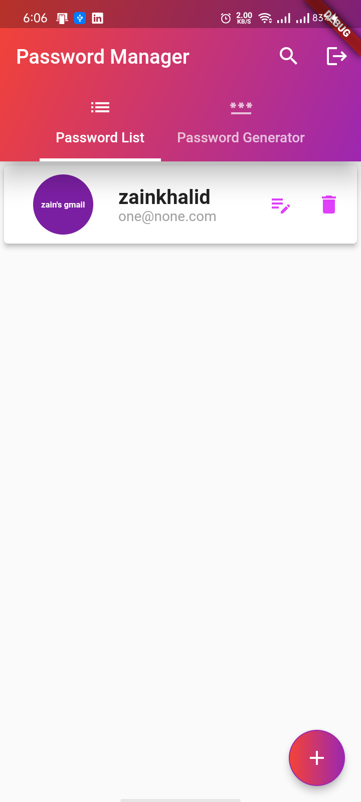
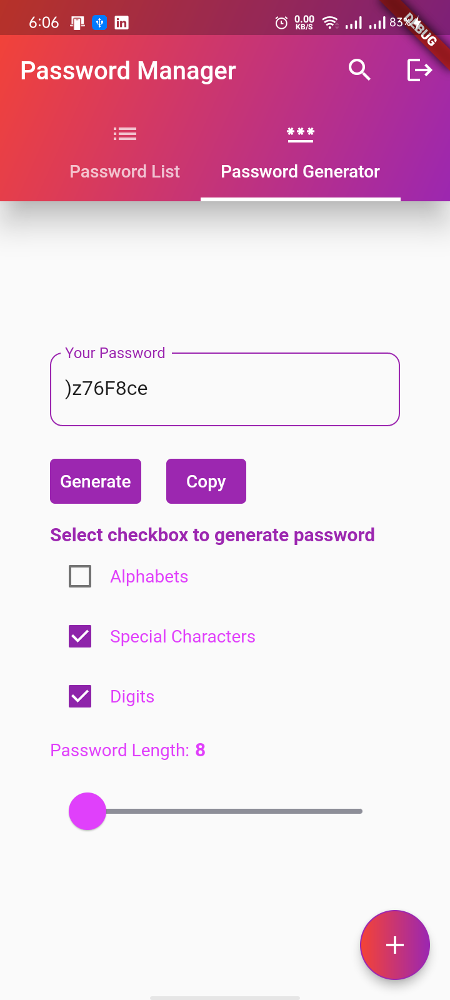
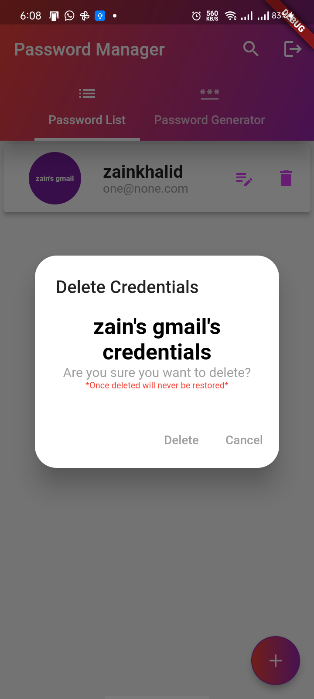
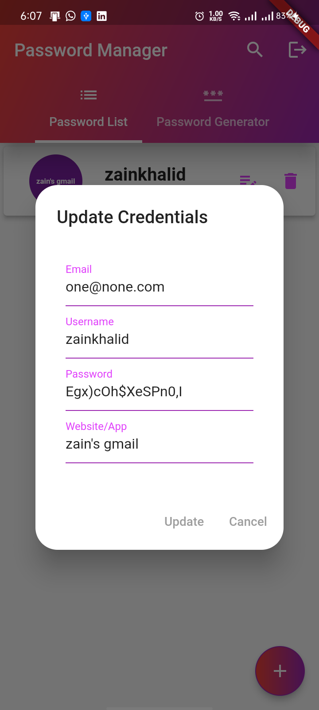
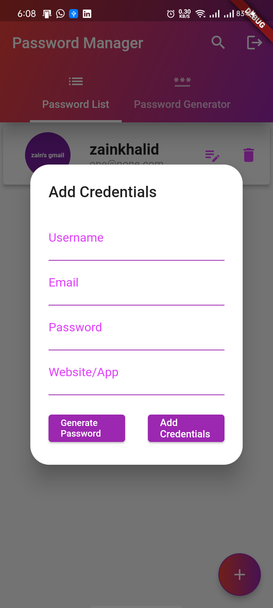

# password_manager

A new Flutter project.

## Getting Started

#### What is it about?
This project will help user to take controll of password management so that he can take care of his passwords by himself.
This application will also help user to create random passwords of your own choice. 

User will be able to mark name them with the name of a website or the app he is storing password for.

### Features of app
User should also be able to update , delete, add and some more simple actions as well along with creating random password of your own choice of combination of character 
and your own length.

The default length of a random  password is 8 character, combination of characters will be including all the type of characters mean upper case, lower case, numbers and special characters as well.

User is also able to search with the username of credentials in list.

This app requires internet to work as it logins and registers and authenticate user with firebase. 
There is a limit  

#### Here are some snapshots with operations.

###### List of saved credentials

###### Search Credentials using username

###### Password Generator
here we can generate password of our own type using numerics,special characters and alphabets with our own length minimum is 8 and copy it. If we uncelect all of the check boxes then we would not be able to generate password and an error will be show.

###### Delete Credentials 
if we click on delete button this will appear as a warning

###### Update Credentials 

###### Add Credentials 
we can also generate a random password here by clicking the "Generate Password" button

