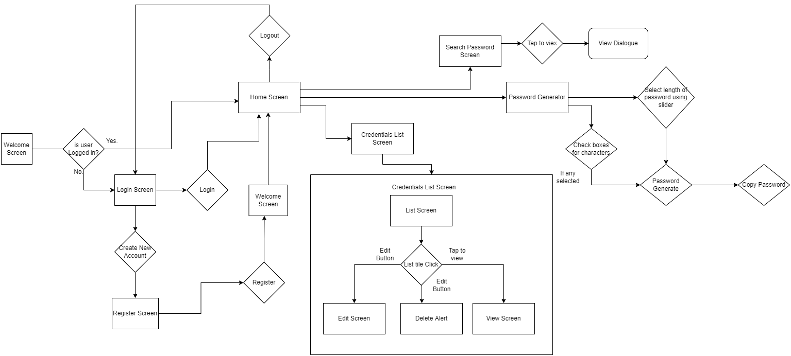
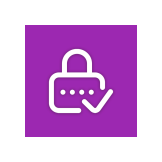

# Password Manager
A new Flutter project. Which can help you to take care of your passwords, manage then in a very good manner, you are able to perform many options which totally secure.

### User Flow Diagram

### Use Cases
In this app you can
1. add credentials and Generate random password
2. delete
3. View and copy
4. Generate Random password 
5. update your credentials.
6. Search and then view and copy
7. Authenticate so that only you can access your credentials

### Use Case and Description

1. #### Add Credentials
    You can add credentials at your ease in which you can save your password, email, username if you are having trouble remembering them.
You can also generate a random password by clicking generate random password button which is visible right under your text field. That
wil create a random password and automatically put it in password field.
2. #### Delete credentials
    You can delete credentials that you don't need anymore or you have used it enough and you don't need to keep them as you remember
them but there will be an alert where you will be asked that if you still want to delete them as you may have clicked on delete button
mistakenly.
3. #### View
    View is another use case/feature which is very useful for you. You can view your passwords that you have stored just by clicking 
them and a popup will show up that will give you a view of your credentials and you can also copy your credentials by clicking a button 
against every field.
4. #### Generate Random Password
    This is another feature in this app which can help you complex passwords. This is also let's you choose the combination of characters
that you want to include in your password. Once you have generated a password you can copy it by clicking the copy button available on
that screen.
5. #### Update Your credentials
    This is also a very important and interesting feature which is going to help you about correcting your mistakes or updating if 
anything have changed in the previous saved password. 
6. #### Search ,copy and view
    This is an interesting feature of this app which helps you to search in your credentials with your username. before searching you
will be able to see a list of credentials by which you can also copy and view. But if you have a long list of credentials and it is 
difficult to find one then this search feature is going to be very useful. Once you have found your desired record then you can view 
and copy it easily.
7. #### Authentication
    Authentication is a very useful feature in this app which makes sure that you are not mixing your credentials with anyone else. 
You have your own password that will be limited only to yourself.

###### Watch a video to understand flow of app.

